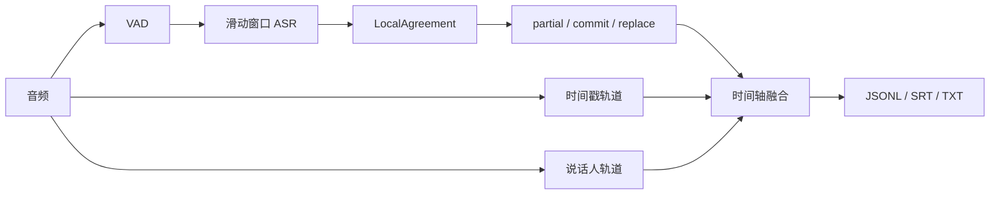
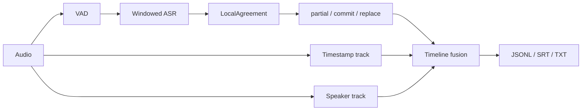

# TurnAlign

[简体中文](#简体中文) | [English](#english)

## 简体中文

一个可替换模型的流式 ASR 编排原型。目前已经搭通文件与麦克风输入、流式识别、稳定文本提交、时间戳对齐和说话人区分链路，并提供终端命令、WebSocket、统一事件协议、设备选择和离线验证工具。

### 流式 ASR 常见问题

流式识别比整段离线转录多了几类问题：

- 模型会反复修改句尾，界面容易出现文字跳动、重复和回滚。
- 固定长度切片可能截断句子，前后窗口也可能生成重复内容。
- 说话人识别需要一段声音才能建立声纹，短插话和重叠说话容易错分。
- 正文、字词时间戳和说话人标签往往来自不同模型，三条结果需要重新对齐。
- CUDA、ROCm、MPS 和 CPU 后端的设备名称、精度和可用算子有差异。

### 处理方式



- `LocalAgreement` 比较连续窗口的识别结果，只提交稳定的公共前缀，句尾继续保留为可修改文本。
- 事件分为 `partial`、`commit`、`replace`、`speaker_merge` 和 `end`，客户端可以按 `segment_id` 更新已有内容。
- 正文、时间戳和说话人标签分别保存，再按时间区间融合。某个模型可以单独替换，不需要改动公共事件格式。
- 插件通过 Python entry point 注册，ASR、VAD、时间对齐和说话人模块各自声明支持的设备。
- `turnalign doctor` 检测 NVIDIA CUDA、AMD ROCm、Apple MPS 和 CPU，并输出模型后端可直接使用的设备与精度配置。

### 当前用到的开源项目

| 项目 | 用途 |
|---|---|
| GLM-ASR-Nano-2512 | 当前实验的中文正文识别 |
| OpenAI Whisper Medium + Hugging Face Transformers | 对照转录和 GPU 性能测试 |
| FunASR | FSMN-VAD、Paraformer 时间戳与转录、CAM++ 说话人声纹 |
| UMAP + HDBSCAN | 长录音的全局说话人聚类 |
| PyTorch | CUDA、ROCm 和 MPS 推理接口 |
| ONNX Runtime | CPU 和可选执行 Provider 的接口预留 |

模型代码、权重和数据各自遵循原项目许可证。TurnAlign 核心代码使用 MIT License。运行时依赖、实验组件和设计参考统一列在 [ACKNOWLEDGEMENTS.md](ACKNOWLEDGEMENTS.md)，其中包括 WhisperLive、Whisper-Streaming、SimulStreaming、whisper.cpp、sherpa-onnx、WhisperX、Silero VAD 和 pyannote.audio 等项目。

### 输入、模型和接口

- 文件输入支持 PCM16 WAV；安装 FFmpeg 后可以读取 MP3、M4A 及 FFmpeg 能解码的其他格式。
- 麦克风通过可选的 `sounddevice`/PortAudio 依赖采集，Windows、macOS 和 Linux 使用相同命令。
- 内置 ASR 适配器包括 `glm-asr`、`transformers-whisper`、`faster-whisper`、`funasr` 和 `whisper-cpp`。第三方模型可以通过 Python entry point 注册。
- 文件转录默认使用自适应 `energy` VAD 安全切段，并将所有语音和跳过区间写入独立审计 JSONL；也可以切换到 `fsmn-vad`。
- 官方可选 FunASR 组件包括 FSMN-VAD、Paraformer 字词时间对齐和 CAM++ 离线说话人区分，安装后可直接通过统一 CLI 发现和调用。
- 批处理模型在麦克风和 WebSocket 模式下按滚动窗口输出 `partial`，检测到静音或达到最长片段时输出 `commit`；原生流式插件可以直接产生相同事件。
- WebSocket 接受 PCM16 二进制帧并返回 JSON 事件。协议见 [docs/websocket.md](docs/websocket.md)。

### 已完成的验证

测试音频是一段 129.4 分钟、16 kHz 单声道录音，包含环境噪声、闲聊和两人主讨论。

- GLM-ASR 全量转录：259 个 30 秒片段，AMD GPU 耗时 980.6 秒。
- Whisper Medium 全量转录：259 个片段，AMD GPU 耗时 1799.2 秒。
- FSMN-VAD + Paraformer + CAM++：耗时 369.2 秒，约 21 倍实时，峰值显存 1.61 GB。
- 说话人聚类得到 3 个簇：前段环境/闲聊人物 1 个，主讨论人物 2 个。
- 导出 2777 个非空语音段；时间轴没有乱序和相邻重叠。
- GLM 正文与 Paraformer 时间轴融合后得到 466 个可读段，局部字符对齐率中位数为 88.6%。
- 公共事件校验通过，当前单元与集成测试共 41 项，其中包含滚动 partial、WebSocket 本机回环和时间戳/说话人回写测试。
- AMD RX 7650 GRE 已完成真实硬件验证。Apple Silicon Mac Studio 已完成 macOS 实体机器验证，PyTorch 2.13.0 MPS 设备检测、FP16 张量计算和 Transformers Whisper 端到端转录均通过。NVIDIA CUDA 目前完成设备探针与选择逻辑测试，尚未进行实体机器性能测试。

详细记录见 [docs/validation.md](docs/validation.md)。

### 隐私

- 仓库不包含测试音频、完整转录、字幕、模型权重或本机用户路径。
- 核心包没有遥测和音频上传逻辑，转录与说话人处理可以完全在本地运行。
- 模型插件可能在首次使用时下载权重，具体网络行为由对应插件和上游项目决定。

### 当前限制

- 没有浏览器上传页面；文件、麦克风、CLI 和 WebSocket 已可使用。
- `glm-asr`、`transformers-whisper`、`faster-whisper`、`funasr` 和 `whisper-cpp` 属于可选适配器，需要分别安装对应运行时或可执行文件。
- 默认 `energy` VAD 是自适应能量阈值兜底方案；复杂噪声环境建议安装并选择 `fsmn-vad`。
- 说话人结果没有人工标注真值，暂时无法给出可靠的 DER。
- 很短的应答、抢话和重叠语音仍可能分到相邻说话人。
- GLM 正文按 30 秒窗口与 Paraformer 时间轴对齐，边界属于近似结果。

### 快速开始

项目核心只使用 Python 标准库。按需要安装可选功能：

```bash
python -m pip install .
python -m pip install ".[microphone,server,transformers]"
python -m pip install ".[funasr-pipeline]"
turnalign doctor --device auto
turnalign backends
```

转录文件、麦克风和启动 WebSocket：

```bash
turnalign transcribe meeting.mp3 --backend glm-asr --language zh --output meeting.jsonl
turnalign transcribe meeting.mp3 --backend glm-asr --vad-backend fsmn-vad \
  --vad-option device=cpu --aligner paraformer --aligner-option device=cpu \
  --diarizer campp --diarizer-option device=cpu --output meeting.jsonl
turnalign listen --backend transformers-whisper --model openai/whisper-small --language zh
turnalign audio-devices
turnalign record sample.wav --duration 10
turnalign serve --backend glm-asr --device auto
python examples/websocket_file_client.py sample.wav --backend glm-asr --language zh
```

源码运行：

```powershell
$env:PYTHONPATH = "$PWD\src"
python -m turnalign.cli doctor --device auto

python -m turnalign.cli replay `
  "path\to\transcript.jsonl" `
  --output demo-events.jsonl

python -m turnalign.cli validate-events demo-events.jsonl
python -m unittest discover -s tests -v
```

可以通过 `--device cuda:0`、`rocm:0`、`mps` 或 `cpu` 固定设备。服务部署也可以设置 `TURNALIGN_DEVICE`。跨平台说明见 [docs/platforms.md](docs/platforms.md)，内部结构见 [docs/architecture.md](docs/architecture.md)。

文件转录默认启用 `energy` VAD；只有已确认模型可接受整段输入的短音频才建议使用 `--no-vad`。指定输出文件时，VAD 审计默认写入同目录的 `*.vad.jsonl`，末尾 `end` 事件同时报告语音时长、跳过时长、语音区间数和强制切段数。完整 FunASR 后处理在 Apple Silicon 上建议让 GLM-ASR 使用 MPS，FSMN/Paraformer/CAM++ 使用 CPU。

### 在编码代理中使用

TurnAlign 不依赖图形界面。Codex、Claude Code 等编码代理可以直接运行 `transcribe`、`listen` 和 `serve`，逐行读取 JSONL，也可以按 [docs/architecture.md](docs/architecture.md) 接入其他 ASR、VAD、时间对齐或说话人模型。核心没有账号、遥测或云端音频接口。

---

## English

TurnAlign is a model-replaceable streaming ASR orchestration prototype. It connects file and microphone input, streaming recognition, stable-text commits, timestamp alignment, and speaker diarization through a common event protocol. It provides terminal commands and a raw-PCM WebSocket transport.

### Common streaming ASR issues

- Models revise the tail of a sentence repeatedly, which can cause flicker, duplicates, and rollbacks in the client.
- Fixed-size chunks may cut through a sentence, while overlapping windows may repeat text.
- Speaker identification needs enough speech to form an embedding. Short interjections and overlapping speech remain difficult.
- Text, word timing, and speaker labels often come from separate models and need to be aligned again.
- CUDA, ROCm, MPS, and CPU runtimes use different device names, precisions, and operator sets.

### How it works



- `LocalAgreement` compares consecutive hypotheses and commits their stable common prefix. The tail remains editable.
- Events use `partial`, `commit`, `replace`, `speaker_merge`, and `end`. Clients update existing content through a stable `segment_id`.
- Text, timestamps, and speaker turns are stored as separate tracks and fused by time range.
- ASR, VAD, alignment, and diarization plugins register through Python entry points and declare their supported accelerators.
- `turnalign doctor` detects NVIDIA CUDA, AMD ROCm, Apple MPS, and CPU targets and returns backend-ready device and precision settings.

### Open-source components used

| Project | Use in this prototype |
|---|---|
| GLM-ASR-Nano-2512 | Chinese transcript text in the current experiment |
| OpenAI Whisper Medium + Hugging Face Transformers | Reference transcript and GPU performance comparison |
| FunASR | FSMN-VAD, Paraformer timestamps/transcript, and CAM++ speaker embeddings |
| UMAP + HDBSCAN | Global speaker clustering for long recordings |
| PyTorch | CUDA, ROCm, and MPS inference interface |
| ONNX Runtime | Reserved CPU and optional execution-provider interface |

Model code, weights, and datasets retain their respective upstream licenses. The TurnAlign core is MIT licensed. Runtime dependencies, experimental components, and design references are listed in [ACKNOWLEDGEMENTS.md](ACKNOWLEDGEMENTS.md), including WhisperLive, Whisper-Streaming, SimulStreaming, whisper.cpp, sherpa-onnx, WhisperX, Silero VAD, and pyannote.audio.

### Inputs, models, and interfaces

- PCM16 WAV works through the standard library. FFmpeg enables MP3, M4A, and other formats it can decode.
- Optional `sounddevice`/PortAudio capture provides the same microphone command on Windows, macOS, and Linux.
- Built-in ASR adapters cover `glm-asr`, `transformers-whisper`, `faster-whisper`, `funasr`, and `whisper-cpp`. External models register through Python entry points.
- File transcription defaults to adaptive `energy` VAD, safely segments long input, and writes every speech/skipped interval to a separate audit JSONL. `fsmn-vad` is available as an alternative.
- First-party optional FunASR components provide FSMN-VAD, Paraformer word timing, and offline CAM++ diarization through the common CLI.
- Batch models emit rolling `partial` updates in microphone and WebSocket sessions, then `commit` after silence or a maximum utterance length. Native streaming plugins emit the same events directly.
- WebSocket accepts PCM16 binary frames and returns JSON events. See [docs/websocket.md](docs/websocket.md).

### Validation results

The test recording is 129.4 minutes of 16 kHz mono audio with background noise, casual conversation, and a two-person main discussion.

- GLM-ASR full transcript: 259 thirty-second chunks in 980.6 seconds on an AMD GPU.
- Whisper Medium full transcript: 259 chunks in 1799.2 seconds on the same GPU.
- FSMN-VAD + Paraformer + CAM++: 369.2 seconds, about 21x real time, with 1.61 GB peak allocated VRAM.
- Speaker clustering produced three clusters: one for the earlier ambient/casual section and two for the main discussion.
- The export contains 2,777 non-empty speech turns with no invalid ordering or adjacent overlap.
- Fusion of GLM text with the Paraformer timeline produced 466 readable turns. Median local character alignment was 88.6%.
- The common event validator passes, along with 41 unit and integration tests, including rolling partials, loopback WebSocket, and alignment/diarization replacement flow.
- AMD RX 7650 GRE has been tested on physical hardware. An Apple Silicon Mac Studio has also completed physical macOS validation, including PyTorch 2.13.0 MPS detection, FP16 tensor computation, and end-to-end Transformers Whisper transcription. NVIDIA CUDA currently has probe and selection-path coverage, without physical performance benchmarks yet.

See [docs/validation.md](docs/validation.md) for the full run log and metrics.

### Privacy

- The repository contains no test audio, full transcripts, subtitles, model weights, or local user paths.
- The core package has no telemetry or audio-upload path. Transcription and diarization can run entirely on the local machine.
- Model plugins may download weights on first use. Their network behaviour is controlled by each plugin and its upstream project.

### Current limitations

- There is no browser upload page. File input, microphone capture, CLI, and WebSocket transport are available.
- `glm-asr`, `transformers-whisper`, `faster-whisper`, `funasr`, and `whisper-cpp` are optional adapters and require their corresponding runtime or executable.
- The default adaptive energy VAD is a dependency-free fallback. Install and select `fsmn-vad` for difficult noise.
- The speaker output has no human-labelled reference, so a reliable DER is not available.
- Very short responses, interruptions, and overlapping speech may be assigned to a neighbouring speaker.
- GLM text is aligned to the Paraformer timeline inside 30-second source windows, so speaker boundaries are approximate.

### Quick start

The core package uses only the Python standard library. Install optional features as needed:

```bash
python -m pip install .
python -m pip install ".[microphone,server,transformers]"
python -m pip install ".[funasr-pipeline]"
turnalign doctor --device auto
turnalign backends
turnalign transcribe meeting.mp3 --backend glm-asr --language zh --output meeting.jsonl
turnalign transcribe meeting.mp3 --backend glm-asr --vad-backend fsmn-vad \
  --vad-option device=cpu --aligner paraformer --aligner-option device=cpu \
  --diarizer campp --diarizer-option device=cpu --output meeting.jsonl
turnalign listen --backend transformers-whisper --model openai/whisper-small
turnalign serve --backend glm-asr --device auto
```

Run from source:

```bash
export PYTHONPATH="$PWD/src"
python -m turnalign.cli doctor --device auto
python -m unittest discover -s tests -v
```

Use `--device cuda:0`, `rocm:0`, `mps`, or `cpu` to pin a target. Service deployments can also set `TURNALIGN_DEVICE`. See [docs/platforms.md](docs/platforms.md) for platform setup and [docs/architecture.md](docs/architecture.md) for the internal contracts.

File transcription enables `energy` VAD by default; use `--no-vad` only for short audio that the selected model can accept in one request. With an output path, the VAD audit is written beside it as `*.vad.jsonl`, while the terminal `end` event reports speech, skipped audio, region, and forced-split totals. On Apple Silicon, the full optional pipeline is intended to run GLM-ASR on MPS and FSMN/Paraformer/CAM++ on CPU.

### Use with coding agents

TurnAlign does not require a graphical interface. Coding agents such as Codex and Claude Code can run `transcribe`, `listen`, and `serve`, consume JSONL line by line, or connect more ASR, VAD, alignment, and diarization models through [the plugin contracts](docs/architecture.md). The core has no account, telemetry, or cloud-audio endpoint.
