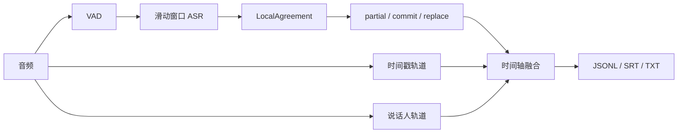
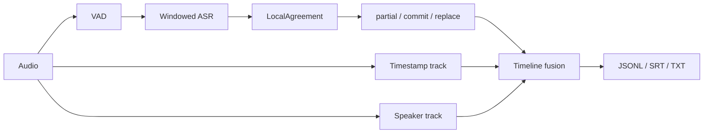

# TurnAlign

[简体中文](#简体中文) | [English](#english)

## 简体中文

一个可替换模型的流式 ASR 编排原型。目前已经搭通文件与麦克风输入、流式识别、稳定文本提交、时间戳对齐和说话人区分链路，并提供终端命令、WebSocket、统一事件协议、设备选择和离线验证工具。

### 流式 ASR 常见问题

流式识别比整段离线转录多了几类问题：

- 模型会反复修改句尾，界面容易出现文字跳动、重复和回滚。
- 固定长度切片可能截断句子，前后窗口也可能生成重复内容。
- 说话人识别需要一段声音才能建立声纹，短插话和重叠说话容易错分。
- 正文、字词时间戳和说话人标签往往来自不同模型，三条结果需要重新对齐。
- CUDA、ROCm、MPS、CPU 以及 whisper.cpp Vulkan 运行时的设备名称、精度和可用算子有差异。

### 处理方式



- `LocalAgreement` 比较连续窗口的识别结果，只提交稳定的公共前缀，句尾继续保留为可修改文本。
- 事件分为 `partial`、`commit`、`replace`、`speaker_merge` 和 `end`，客户端可以按 `segment_id` 更新已有内容。
- 正文、时间戳和说话人标签分别保存，再按时间区间融合。某个模型可以单独替换，不需要改动公共事件格式。
- 插件通过 Python entry point 注册，ASR、VAD、时间对齐和说话人模块各自声明支持的设备。
- `turnalign doctor` 检测 NVIDIA CUDA、AMD ROCm、Apple MPS 和 CPU，并输出模型后端可直接使用的设备与精度配置。

### 当前用到的开源项目

| 项目 | 用途 |
|---|---|
| GLM-ASR-Nano-2512 | 当前实验的中文正文识别 |
| OpenAI Whisper Medium + Hugging Face Transformers | 对照转录和 GPU 性能测试 |
| FunASR | FSMN-VAD、Paraformer 时间戳与转录、CAM++ 说话人声纹 |
| UMAP + HDBSCAN | 仓库外长录音验证中的全局说话人聚类（非内置运行时） |
| PyTorch | CUDA、ROCm 和 MPS 推理接口 |
| ONNX Runtime | CPU 和可选执行 Provider 的接口预留 |

模型代码、权重和数据各自遵循原项目许可证。TurnAlign 核心代码使用 MIT License。运行时依赖、实验组件和设计参考统一列在 [ACKNOWLEDGEMENTS.md](ACKNOWLEDGEMENTS.md)，其中包括 WhisperLive、Whisper-Streaming、SimulStreaming、whisper.cpp、sherpa-onnx、WhisperX、Silero VAD 和 pyannote.audio 等项目。

### 输入、模型和接口

- 文件输入支持 PCM16 WAV；安装 FFmpeg 后可以读取 MP3、M4A 及 FFmpeg 能解码的其他格式。
- 麦克风通过可选的 `sounddevice`/PortAudio 依赖采集，Windows、macOS 和 Linux 使用相同命令。
- 内置 ASR 适配器包括 `glm-asr`、`transformers-whisper`、`faster-whisper`、`funasr`、原生增量 `funasr-streaming` 和 `whisper-cpp`。第三方模型可以通过 Python entry point 注册。
- 文件转录默认使用自适应 `energy` VAD 安全切段，并将所有语音和跳过区间写入独立审计 JSONL；也可以切换到 `fsmn-vad`。
- 官方可选 FunASR 组件包括 FSMN-VAD、Paraformer 字词时间对齐和 CAM++ 离线说话人区分，安装后可直接通过统一 CLI 发现和调用。
- 用户可以通过 `--hotword`、`--hotwords-file`、`--context` 或 `--context-file` 提供本地私有词表与主题上下文。TurnAlign 会按后端映射到 GLM prompt、Whisper prompt 或 FunASR/faster-whisper 原生热词接口。
- 批处理模型在麦克风和 WebSocket 模式下按滚动窗口输出 `partial`，检测到静音或达到最长片段时输出 `commit`；原生流式插件可以直接产生相同事件。
- `RealtimePipeline` 与 `OfflineRefinementPipeline` 可以组成两遍处理：第一遍同步写入磁盘音频时间线，第二遍使用同一 `segment_id` 修正文稿、时间和说话人。
- WebSocket 接受 PCM16 二进制帧并统一重分帧；模型加载成功后才返回 `ready`，默认禁止客户端指定任意模型路径或可执行文件。协议见 [docs/websocket.md](docs/websocket.md)。

### 私有热词与上下文

TurnAlign 使用同一组参数为不同 ASR 后端提供热词或上下文提示：

```bash
turnalign transcribe audio.mp3 --backend glm-asr \
  --hotwords-file /path/to/private-phrases.txt \
  --context-file /path/to/private-context.txt \
  --output transcript.jsonl
```

- `--hotword PHRASE`：添加一个短语，可以重复使用。
- `--hotwords-file PATH`：读取 UTF-8 词表，每行一个短语；忽略空行和以 `#` 开头的行。
- `--context TEXT` / `--context-file PATH`：提供主题上下文，仅限支持 prompt 的后端。
- `--hotword-boost NUMBER`：预留给明确支持加权热词的后端；其他后端会直接报错。

| 后端 | 热词映射 | 自由上下文 |
|---|---|---|
| `glm-asr` | 受约束的转录 prompt | 支持 |
| `transformers-whisper` | Whisper initial prompt | 支持 |
| `faster-whisper` | 原生 `hotwords` | 支持，通过 `initial_prompt` |
| `funasr` | 原生 `hotword` | 不支持 |
| `whisper-cpp` | `--prompt` | 默认禁用；接受本机进程列表泄露风险后，显式设置 `--backend-option allow_prompt_argv=true` |

实际词表和上下文不会复制到 TurnAlign 事件或 WebSocket ready 消息；只记录使用方式、词条数量和是否使用上下文。不支持的组合会在加载模型权重前失败，不会静默忽略。

### 跨平台执行配置

`--execution-profile auto` 会根据操作系统、加速器类型和 GPU 数量选择设备、对齐批量及并行策略。`turnalign doctor` 显示当前选择，`turnalign profiles` 列出所有配置。

| Profile | 适用平台 | 默认策略 |
|---|---|---|
| `mac-balanced` | Apple Silicon | MPS ASR + CPU 后处理并行，alignment batch 4 |
| `cuda-single-gpu` | NVIDIA 单卡 | 所有模型使用同一 GPU，按阶段执行 |
| `cuda-multi-gpu` | NVIDIA 多卡 | GPU 0 ASR，GPU 1 后处理，并行执行 |
| `rocm-linux` | AMD ROCm Linux | PyTorch 模型使用同一 AMD GPU，按阶段执行 |
| `rocm-windows` | AMD ROCm Windows | GPU ASR + 保守 CPU 后处理并行，alignment batch 1 |
| `cpu-low-memory` | 无可用 GPU | 串行执行，alignment batch 2 |

用户显式提供的 `--device`、`--vad-option device=...`、`--aligner-option device=...`、`--diarizer-option device=...`、batch 和并行开关始终优先于 profile 默认值。

### 已完成的验证

测试音频是一段 129.4 分钟、16 kHz 单声道录音，包含环境噪声、闲聊和两人主讨论。

- GLM-ASR 全量转录：259 个 30 秒片段，AMD GPU 耗时 980.6 秒。
- Whisper Medium 全量转录：259 个片段，AMD GPU 耗时 1799.2 秒。
- FSMN-VAD + Paraformer + CAM++：耗时 369.2 秒，约 21 倍实时，峰值显存 1.61 GB。
- 说话人聚类得到 3 个簇：前段环境/闲聊人物 1 个，主讨论人物 2 个。
- 导出 2777 个非空语音段；时间轴没有乱序和相邻重叠。
- GLM 正文与 Paraformer 时间轴融合后得到 466 个可读段，局部字符对齐率中位数为 88.6%。
- 公共事件校验覆盖 `partial → commit → replace` 状态机；自动化测试覆盖原生增量流式、两遍处理、磁盘时间线、WebSocket 初始化/策略/模型复用、私有热词脱敏、跨平台 profile、并行后处理、批量时间对齐和 whisper.cpp Vulkan 参数约束。
- AMD RX 7650 GRE + PyTorch ROCm 已完成真实全链路硬件验证；该结论不涵盖同一显卡的 DirectML 或 Vulkan 路径。
- Windows AMD 核显上的 `whisper.cpp` Vulkan 已完成 TurnAlign 短样本端到端验证：固定 v1.8.4 下游包使用 `vulkan:1`，RTF 为 0.9579，整机 CPU 平均 12.63%、峰值 18.83%，事件校验通过。但 `small-q5_1` 文本质量较差且没有人工真值；RX 7650 GRE 使用同一包的 `vulkan:0` 两次均以 `0xC0000409` 崩溃。因此这里只验证核显执行链路，不宣称 Vulkan 转写质量或独显兼容性。
- 仓库外 DirectML A/B 在固定 PyTorch 2.4.1、torch-directml 0.2.5.dev240914、Transformers 4.57.6 组合下确认：必须读取结构化生成结果的 `.sequences`，才能避开裸 Tensor 被错误物化为 `[0, 0]` 的问题。修复后核显与 RX 7650 GRE 的 FP16 短样本可运行；核显 FP32 文本仍不可靠。TurnAlign 当前不内置 DirectML 适配器，因此这不是受支持后端的验收声明。
- CPU-only 保留既有 faster-whisper Medium INT8、4 线程、VAD 开启和 Windows `BelowNormal` 的 120 秒实测结果（约 4.27 倍实时、整机 CPU 平均 42.03%）；本轮没有重跑会占满 CPU 的 12 线程方案。
- Apple Silicon Mac Studio 已完成 macOS 实体机器验证，PyTorch 2.13.0 MPS 设备检测、FP16 张量计算和 Transformers Whisper 端到端转录均通过。NVIDIA CUDA 目前完成设备探针与选择逻辑测试，尚未进行实体机器性能测试。

详细记录见 [docs/validation.md](docs/validation.md)。

### 隐私

- 仓库不包含测试音频、完整转录、字幕、模型权重或本机用户路径。
- 核心包没有遥测和音频上传逻辑，转录与说话人处理可以完全在本地运行。
- 模型插件可能在首次使用时下载权重，具体网络行为由对应插件和上游项目决定。

### 当前限制

- 没有浏览器上传页面；文件、麦克风、CLI 和 WebSocket 已可使用。
- `glm-asr`、`transformers-whisper`、`faster-whisper`、`funasr` 和 `whisper-cpp` 属于可选适配器，需要分别安装对应运行时或可执行文件。
- 默认 `energy` VAD 是自适应能量阈值兜底方案；复杂噪声环境建议安装并选择 `fsmn-vad`。
- 说话人结果没有人工标注真值，暂时无法给出可靠的 DER。
- 很短的应答、抢话和重叠语音仍可能分到相邻说话人。
- 在线说话人会话接口已经存在，但仓库尚未内置经过人工 DER 验证的在线说话人模型；CAM++ 仍用于离线全局修正。
- WebSocket v1 可在同一服务进程内凭 `session_id` 与独立高熵 `resume_token` 断线续传，并在有界事件窗口内重放未确认事件；确认点过旧或跨进程恢复仍需客户端保留源音频。
- 公共音频时间线和对齐切片已磁盘化并有界分批；当前 FSMN-VAD/CAM++ 上游离线 API 仍会为模型生成完整浮点输入，因此默认拒绝超过 3 小时的单次输入。可用 `--vad-option max_materialized_seconds=...` 或 `--diarizer-option max_materialized_seconds=...` 显式调整，但应先按部署内存容量测算。
- whisper.cpp 官方 CLI 只接受命令行 `--prompt`；TurnAlign 因此默认拒绝向该后端传递私有热词或上下文。只有能接受同机用户通过进程列表读取提示词的部署，才应显式设置 `--backend-option allow_prompt_argv=true`。
- GLM 正文按 30 秒窗口与 Paraformer 时间轴对齐，边界属于近似结果。
- Vulkan 的设备稳定性取决于具体可执行包、驱动和 GPU；本机核显短样本可运行不代表质量合格，固定 v1.8.4 包的 RX 7650 GRE 路径未通过。

### 快速开始

项目核心只使用 Python 标准库。按需要安装可选功能：

```bash
python -m pip install .
python -m pip install ".[microphone,server,transformers]"
python -m pip install ".[funasr-pipeline]"
turnalign doctor --device auto
turnalign profiles
turnalign backends
```

转录文件、麦克风和启动 WebSocket：

```bash
turnalign transcribe meeting.mp3 --backend glm-asr --language zh --output meeting.jsonl
turnalign transcribe meeting.mp3 --backend glm-asr --hotwords-file /path/to/private-phrases.txt --output meeting.jsonl
turnalign transcribe meeting.mp3 --backend glm-asr --execution-profile auto \
  --vad-backend fsmn-vad --aligner paraformer --diarizer campp \
  --output meeting.jsonl
turnalign transcribe meeting.wav --backend whisper-cpp \
  --executable /path/to/whisper-cli --model-path /path/to/model.bin \
  --device vulkan:1 --backend-option threads=2 \
  --backend-option flash_attention=false --output meeting.jsonl
turnalign listen --backend transformers-whisper --model openai/whisper-small --language zh
turnalign listen --backend funasr-streaming --model paraformer-zh-streaming --language zh
turnalign listen --backend funasr-streaming --refinement-backend funasr \
  --refinement-model paraformer-zh --aligner paraformer --diarizer campp
turnalign release-gate sample-30s.wav --backend funasr-streaming \
  --model paraformer-zh-streaming --device cpu --output release-events.jsonl \
  --source-commit "$(git rev-parse HEAD)" --report release-report.json \
  --max-initialization-seconds 120 --max-first-partial-seconds 3 \
  --max-first-commit-seconds "$MAX_FIRST_COMMIT_SECONDS" \
  --require-immutable-model-revision \
  --max-realtime-factor 1
turnalign quality-gate reference.jsonl release-events.jsonl \
  --max-cer "$MAX_CER" --min-reference-speech-seconds "$MIN_LABELLED_SECONDS" \
  --source-commit "$(git rev-parse HEAD)" --report quality-report.json
turnalign audio-devices
turnalign record sample.wav --duration 10
turnalign serve --backend glm-asr --device auto --language zh
# 非本机部署必须显式 --allow-remote，并建议配置反向代理 TLS 与文件型认证：
turnalign serve --backend glm-asr --language zh --allow-remote \
  --auth-token-file /path/to/restricted/auth-token --preload \
  --require-immutable-model-revision --allow-origin https://app.example
turnalign websocket-gate wss://asr.example/ws --sessions 8 \
  --audio-seconds 60 --realtime --max-ready-seconds 10 \
  --max-total-seconds 75 --min-audio-acks 600 \
  --max-dropped-partials 0 --max-backpressure-pauses 0 --verify-recovery \
  --auth-token-file /path/to/restricted/auth-token \
  --source-commit "$(git rev-parse HEAD)" --report websocket-report.json
turnalign production-gate release-report.json quality-report.json websocket-report.json \
  --source-commit "$(git rev-parse HEAD)" \
  --artifact wheel=dist/turnalign.whl --artifact dependency-lock=requirements.lock \
  --artifact sbom=sbom.cdx.json \
  --artifact release-audio=sample-30s.wav \
  --artifact quality-reference=reference.jsonl \
  --artifact quality-hypothesis=release-events.jsonl \
  --artifact model=/models/model.safetensors --artifact nginx-config=/etc/nginx/nginx.conf \
  --artifact service-unit=/etc/systemd/system/turnalign.service \
  --artifact host-profile=host-profile.json --report production-report.json
python examples/websocket_file_client.py sample.wav --backend glm-asr --language zh
```

`release-gate` 必须调用真实后端，而不是 mock。它会验证事件状态机、原生流式声明、首个 partial、可选的首次 commit 延迟、最少 commit 数、初始化时间和 RTF，并在任一门槛失败时返回非零退出码。默认要求至少 10 秒音频；应将 `--output` 生成的 JSONL 与命令输出一并保存为发布证据。准确率发布门禁使用人工标注 JSONL 执行 `turnalign quality-gate`：至少配置一项 CER、WER、说话人错误或修订稳定性上限，并按目标场景设定最小标注规模；任一条件失败时返回非零退出码。中文参考没有人工分词时应以 CER 为主。说话人指标是单活跃说话人区间分数，不等同于支持重叠语音与 collar 的标准 DER。阈值必须由实际产品容忍度和代表性语料得出，仓库不提供虚构的通用阈值。`turnalign evaluate` 仍可用于只生成指标、不阻断发布的分析。

`websocket-gate` 使用生成的静音并发检查已部署服务的协议、流控、确认、完成率和延迟，不保存识别文本或恢复凭证。默认要求每会话至少一个 ACK 且不允许丢弃 partial，可用 `--min-audio-acks`、`--max-dropped-partials` 和 `--max-backpressure-pauses` 收紧目标环境门槛。它只证明传输与生命周期，不证明识别质量；突发测试不加 `--realtime`，长稳测试则加上该参数。生产 TLS 应由反向代理或服务网格终止，门槛直接访问外部 `wss://` 地址。非浏览器客户默认允许；浏览器 Origin 默认拒绝，必须用 `--allow-origin` 精确放行。`GET /healthz` 和 `GET /readyz` 可用作存活/就绪探针；仅回环访问的 `GET /metrics` 提供不含标签、文本和凭证的 Prometheus 运行指标，示例 Nginx 明确拒绝公网 `/metrics`。进程收到 `SIGTERM` 后会停止接入、关闭现有连接并在 `--shutdown-grace-timeout` 后强制取消未退出的处理器。恢复音频默认限制为每会话 512 MiB、每进程 2 GiB，完成后立即释放临时文件；断线会话的默认恢复窗口为 300 秒，超时由后台任务自动清理。相关上限均可通过 `serve --help` 调整。服务进程默认最多接受 32 个会话，但同一模型默认只有一个实例；需要进程内并行时显式设置 `--backend-replicas N`（最多 8，模型内存也近似乘以 N），或部署多个单副本进程。生产服务应加 `--preload`，在监听端口前加载全部副本；配合 `--warmup-file` 可在启动阶段执行真实推理。首次消息、客户端空闲、模型初始化、结束收尾和工作线程退出时间均有界，可通过 `turnalign serve --help` 调整。命令行后端的可执行文件、模型路径和参数可由运维侧通过 `--executable`、`--model-path` 和 `--backend-option KEY=VALUE` 固定，无需开放客户端路径权限。内置后端的私密热词按租约注入并在归还时清空，不同热词会话可复用同一大模型实例。

三个门禁都可用 `--report` 原子保存 JSON 结论。`production-gate` 只在真实模型、人工标注质量和公网 WebSocket 报告均通过，并且报告证明不可变模型、原生流式、`wss://`、实时压测、延迟上限及断线恢复已启用时放行；它要求 wheel、依赖锁、CycloneDX SBOM、发布音频、质量参考/输出、模型、Nginx、systemd 和主机规格十类制品。三份门禁报告必须绑定同一源码提交，音频和质量输入的 SHA-256 必须与聚合制品匹配，防止误用旧报告。依赖锁必须使用带 SHA-256 的精确版本，SBOM 必须标识 TurnAlign 根组件、WebSocket 运行依赖和依赖图，并与所有无条件锁定版本一致；缺项或弱化的门禁会返回非零退出码。

仓库提供一套范围明确的 [Linux CPU systemd + Nginx 参考部署](deploy/README.md)，包含回环绑定、TLS 代理、速率限制、低权限运行、预加载和发布门禁清单。GPU/MPS 部署必须按目标硬件单独验证，不能直接套用这份 CPU 安全单元。

内置 GLM-ASR、Transformers Whisper 和 Paraformer 别名现在固定到不可变提交。正式发布的 `release-gate` 和 `serve` 都应启用 `--require-immutable-model-revision`；服务会在预加载或首次创建后端时拒绝浮动版本。自定义 Hugging Face 模型用 `--backend-option revision=COMMIT_SHA`，自定义 FunASR 模型用 `--backend-option model_revision=COMMIT_SHA`。不提供提交版本元数据的后端应改用经过校验的本地模型制品，并且不要启用该门禁。

文本比较默认严格区分大小写、标点和 Unicode 表示。只有标注规范明确要求时，才使用 `--unicode-normalization NFC|NFKC`、`--ignore-case` 或 `--ignore-punctuation`；实际策略会写入质量报告，避免预处理变化悄悄改变发布结论。

源码运行：

```powershell
$env:PYTHONPATH = "$PWD\src"
python -m turnalign.cli doctor --device auto

python -m turnalign.cli replay `
  "path\to\transcript.jsonl" `
  --output demo-events.jsonl

python -m turnalign.cli validate-events demo-events.jsonl
python -m turnalign.cli evaluate reference.jsonl hypothesis.jsonl
python -m turnalign.cli quality-gate reference.jsonl hypothesis.jsonl --max-cer "$MAX_CER"
python -m unittest discover -s tests -v
```

可以通过 `--device cuda:0`、`rocm:0`、`mps` 或 `cpu` 固定通用设备。`whisper-cpp` 还支持显式 `--device vulkan:N`，索引直接映射到该可执行文件报告的 Vulkan 设备；这条路径不会由 `doctor` 自动探测。服务部署也可以设置 `TURNALIGN_DEVICE`。跨平台说明见 [docs/platforms.md](docs/platforms.md)，内部结构见 [docs/architecture.md](docs/architecture.md)。

`vulkan:N` 映射已在本机 AMD 核显上完成 TurnAlign 端到端验证，但设备可运行不代表转写质量合格，不同 Vulkan 构建和 GPU 必须分别复测。本机 RX 7650 GRE 使用所固定的 v1.8.4 下游包会崩溃。

文件转录默认启用 `energy` VAD；只有已确认模型可接受整段输入的短音频才建议使用 `--no-vad`。指定输出文件时，VAD 审计默认写入同目录的 `*.vad.jsonl`，末尾 `end` 事件同时报告语音时长、跳过时长、语音区间数和强制切段数。完整 FunASR 后处理在 Apple Silicon 上建议让 GLM-ASR 使用 MPS，FSMN/Paraformer/CAM++ 使用 CPU。

离线文件同时使用 GPU/MPS ASR 与 CPU 说话人组件时，TurnAlign 默认并行运行两条轨道；可以用 `--no-parallel-postprocess` 关闭。Paraformer 时间对齐默认使用经过全量基准验证的保守 batch 4，也可以通过 `--aligner-option batch_size=NUMBER` 调整。终止 `end` 事件分别报告 `asr_seconds`、`diarization_seconds`、`alignment_seconds` 和是否启用并行，便于在目标机器上复测。

### 在编码代理中使用

TurnAlign 不依赖图形界面。Codex、Claude Code 等编码代理可以直接运行 `transcribe`、`listen` 和 `serve`，逐行读取 JSONL，也可以按 [docs/architecture.md](docs/architecture.md) 接入其他 ASR、VAD、时间对齐或说话人模型。核心没有账号、遥测或云端音频接口。

---

## English

TurnAlign is a model-replaceable streaming ASR orchestration prototype. It connects file and microphone input, streaming recognition, stable-text commits, timestamp alignment, and speaker diarization through a common event protocol. It provides terminal commands and a raw-PCM WebSocket transport.

### Common streaming ASR issues

- Models revise the tail of a sentence repeatedly, which can cause flicker, duplicates, and rollbacks in the client.
- Fixed-size chunks may cut through a sentence, while overlapping windows may repeat text.
- Speaker identification needs enough speech to form an embedding. Short interjections and overlapping speech remain difficult.
- Text, word timing, and speaker labels often come from separate models and need to be aligned again.
- CUDA, ROCm, MPS, CPU, and whisper.cpp Vulkan runtimes use different device names, precisions, and operator sets.

### How it works



- `LocalAgreement` compares consecutive hypotheses and commits their stable common prefix. The tail remains editable.
- Events use `partial`, `commit`, `replace`, `speaker_merge`, and `end`. Clients update existing content through a stable `segment_id`.
- Text, timestamps, and speaker turns are stored as separate tracks and fused by time range.
- ASR, VAD, alignment, and diarization plugins register through Python entry points and declare their supported accelerators.
- `turnalign doctor` detects NVIDIA CUDA, AMD ROCm, Apple MPS, and CPU targets and returns backend-ready device and precision settings.

### Open-source components used

| Project | Use in this prototype |
|---|---|
| GLM-ASR-Nano-2512 | Chinese transcript text in the current experiment |
| OpenAI Whisper Medium + Hugging Face Transformers | Reference transcript and GPU performance comparison |
| FunASR | FSMN-VAD, Paraformer timestamps/transcript, and CAM++ speaker embeddings |
| UMAP + HDBSCAN | Out-of-tree long-recording validation, not a built-in runtime |
| PyTorch | CUDA, ROCm, and MPS inference interface |
| ONNX Runtime | Reserved CPU and optional execution-provider interface |

Model code, weights, and datasets retain their respective upstream licenses. The TurnAlign core is MIT licensed. Runtime dependencies, experimental components, and design references are listed in [ACKNOWLEDGEMENTS.md](ACKNOWLEDGEMENTS.md), including WhisperLive, Whisper-Streaming, SimulStreaming, whisper.cpp, sherpa-onnx, WhisperX, Silero VAD, and pyannote.audio.

### Inputs, models, and interfaces

- PCM16 WAV works through the standard library. FFmpeg enables MP3, M4A, and other formats it can decode.
- Optional `sounddevice`/PortAudio capture provides the same microphone command on Windows, macOS, and Linux.
- Built-in ASR adapters cover `glm-asr`, `transformers-whisper`, `faster-whisper`, `funasr`, native incremental `funasr-streaming`, and `whisper-cpp`. External models register through Python entry points.
- File transcription defaults to adaptive `energy` VAD, safely segments long input, and writes every speech/skipped interval to a separate audit JSONL. `fsmn-vad` is available as an alternative.
- First-party optional FunASR components provide FSMN-VAD, Paraformer word timing, and offline CAM++ diarization through the common CLI.
- Users can provide local private vocabulary or topic context with `--hotword`, `--hotwords-file`, `--context`, or `--context-file`. TurnAlign maps the same contract to GLM prompts, Whisper prompts, or native FunASR/faster-whisper hotwords.
- Batch models emit rolling `partial` updates in microphone and WebSocket sessions, then `commit` after silence or a maximum utterance length. Native streaming plugins emit the same events directly.
- `RealtimePipeline` and `OfflineRefinementPipeline` form an optional two-pass path: the first pass records to a disk timeline and the second revises text, timing, and speakers under the same `segment_id`.
- WebSocket normalizes PCM16 client frames, waits for successful model loading before `ready`, and rejects arbitrary client paths by default. See [docs/websocket.md](docs/websocket.md).

### Private hotwords and context

TurnAlign uses one set of arguments to provide vocabulary or context hints to different ASR backends:

```bash
turnalign transcribe audio.mp3 --backend glm-asr \
  --hotwords-file /path/to/private-phrases.txt \
  --context-file /path/to/private-context.txt \
  --output transcript.jsonl
```

- `--hotword PHRASE`: add one phrase; repeat as needed.
- `--hotwords-file PATH`: read a UTF-8 file with one phrase per line; blank and `#` lines are ignored.
- `--context TEXT` / `--context-file PATH`: provide topic context to prompt-capable backends.
- `--hotword-boost NUMBER`: reserved for backends that explicitly support weighted hotwords; others fail clearly.

| Backend | Hotword mapping | Free-form context |
|---|---|---|
| `glm-asr` | constrained transcription prompt | supported |
| `transformers-whisper` | Whisper initial prompt | supported |
| `faster-whisper` | native `hotwords` | supported through `initial_prompt` |
| `funasr` | native `hotword` | unsupported |
| `whisper-cpp` | `--prompt` | disabled by default; explicitly set `--backend-option allow_prompt_argv=true` only after accepting local process-list exposure |

TurnAlign events and WebSocket ready messages never copy the actual phrases or context. They report only the application method, phrase count, and whether context was used. Unsupported combinations fail before model weights are loaded instead of being silently ignored.

### Cross-platform execution profiles

`--execution-profile auto` selects devices, alignment batches, and scheduling from the operating system, accelerator type, and GPU count. `turnalign doctor` shows the effective selection, while `turnalign profiles` lists every policy.

| Profile | Target | Default policy |
|---|---|---|
| `mac-balanced` | Apple Silicon | MPS ASR plus parallel CPU post-processing, alignment batch 4 |
| `cuda-single-gpu` | one NVIDIA GPU | all models on one GPU, scheduled by stage |
| `cuda-multi-gpu` | multiple NVIDIA GPUs | GPU 0 ASR, GPU 1 post-processing, concurrent tracks |
| `rocm-linux` | AMD ROCm on Linux | PyTorch models on one AMD GPU, scheduled by stage |
| `rocm-windows` | AMD ROCm on Windows | GPU ASR plus conservative parallel CPU post-processing, batch 1 |
| `cpu-low-memory` | no usable GPU | sequential execution, alignment batch 2 |

Explicit `--device`, component `device=...`, batch, and parallel flags always override profile defaults.

### Validation results

The test recording is 129.4 minutes of 16 kHz mono audio with background noise, casual conversation, and a two-person main discussion.

- GLM-ASR full transcript: 259 thirty-second chunks in 980.6 seconds on an AMD GPU.
- Whisper Medium full transcript: 259 chunks in 1799.2 seconds on the same GPU.
- FSMN-VAD + Paraformer + CAM++: 369.2 seconds, about 21x real time, with 1.61 GB peak allocated VRAM.
- Speaker clustering produced three clusters: one for the earlier ambient/casual section and two for the main discussion.
- The export contains 2,777 non-empty speech turns with no invalid ordering or adjacent overlap.
- Fusion of GLM text with the Paraformer timeline produced 466 readable turns. Median local character alignment was 88.6%.
- The common validator covers the `partial -> commit -> replace` lifecycle. Automated tests cover native incremental streaming, two-pass refinement, disk-backed audio, WebSocket initialization/policy/model reuse, private-hint redaction, cross-platform profiles, parallel post-processing, batched alignment, and whisper.cpp Vulkan constraints.
- AMD RX 7650 GRE plus PyTorch ROCm has completed a real full-pipeline hardware run; this claim does not cover DirectML or Vulkan on the same GPU.
- `whisper.cpp` Vulkan has completed a short TurnAlign end-to-end run on the Windows AMD integrated GPU. With the pinned downstream v1.8.4 build and `vulkan:1`, RTF was 0.9579, whole-system CPU averaged 12.63% and peaked at 18.83%, and event validation passed. The `small-q5_1` text was poor and had no human reference; the same build crashed twice with `0xC0000409` on RX 7650 GRE `vulkan:0`. This verifies only the integrated-GPU execution path, not Vulkan transcript quality or discrete-GPU compatibility.
- An out-of-tree DirectML A/B on pinned PyTorch 2.4.1, torch-directml 0.2.5.dev240914, and Transformers 4.57.6 found that callers must read `.sequences` from structured generation output to avoid a raw Tensor being materialized as `[0, 0]`. FP16 short samples then ran on both AMD GPUs, while integrated-GPU FP32 text remained unreliable. TurnAlign does not ship a DirectML adapter, so this is runtime evidence rather than supported-backend acceptance.
- The existing CPU-only result uses faster-whisper Medium INT8, four threads, VAD, and Windows `BelowNormal` on a 120-second sample (about 4.27x real time and 42.03% average whole-system CPU). The CPU-saturating 12-thread configuration was not rerun.
- An Apple Silicon Mac Studio has completed physical macOS validation, including PyTorch 2.13.0 MPS detection, FP16 tensor computation, and end-to-end Transformers Whisper transcription. NVIDIA CUDA currently has probe and selection-path coverage, without physical performance benchmarks yet.

See [docs/validation.md](docs/validation.md) for the full run log and metrics.

### Privacy

- The repository contains no test audio, full transcripts, subtitles, model weights, or local user paths.
- The core package has no telemetry or audio-upload path. Transcription and diarization can run entirely on the local machine.
- Model plugins may download weights on first use. Their network behaviour is controlled by each plugin and its upstream project.

### Current limitations

- There is no browser upload page. File input, microphone capture, CLI, and WebSocket transport are available.
- `glm-asr`, `transformers-whisper`, `faster-whisper`, `funasr`, and `whisper-cpp` are optional adapters and require their corresponding runtime or executable.
- The default adaptive energy VAD is a dependency-free fallback. Install and select `fsmn-vad` for difficult noise.
- The speaker output has no human-labelled reference, so a reliable DER is not available.
- Very short responses, interruptions, and overlapping speech may be assigned to a neighbouring speaker.
- The online diarization session contract is implemented, but the repository does not yet ship an online speaker model validated against human-labelled DER; CAM++ remains an offline refinement component.
- WebSocket v1 resumes with both `session_id` and its high-entropy `resume_token`, then replays unacknowledged events within a bounded in-process window; clients retain source audio for stale-window or cross-process recovery.
- The common timeline and alignment slices are disk-backed and bounded in batches. Current upstream FSMN-VAD/CAM++ offline APIs still materialize one full float input, so TurnAlign rejects inputs longer than three hours by default. Override with `--vad-option max_materialized_seconds=...` or `--diarizer-option max_materialized_seconds=...` only after sizing deployment memory.
- The official whisper.cpp CLI accepts prompts only through `--prompt`, so TurnAlign rejects private hints for this backend by default. Set `--backend-option allow_prompt_argv=true` only on deployments that accept prompt visibility in the local process list.
- GLM text is aligned to the Paraformer timeline inside 30-second source windows, so speaker boundaries are approximate.
- Vulkan device stability is specific to the executable build, driver, and GPU. A runnable integrated-GPU short sample is not a quality result, and the pinned v1.8.4 build did not pass on the RX 7650 GRE.

### Quick start

The core package uses only the Python standard library. Install optional features as needed:

```bash
python -m pip install .
python -m pip install ".[microphone,server,transformers]"
python -m pip install ".[funasr-pipeline]"
turnalign doctor --device auto
turnalign profiles
turnalign backends
turnalign transcribe meeting.mp3 --backend glm-asr --language zh --output meeting.jsonl
turnalign transcribe meeting.mp3 --backend glm-asr --hotwords-file /path/to/private-phrases.txt --output meeting.jsonl
turnalign transcribe meeting.mp3 --backend glm-asr --execution-profile auto \
  --vad-backend fsmn-vad --aligner paraformer --diarizer campp \
  --output meeting.jsonl
turnalign transcribe meeting.wav --backend whisper-cpp \
  --executable /path/to/whisper-cli --model-path /path/to/model.bin \
  --device vulkan:1 --backend-option threads=2 \
  --backend-option flash_attention=false --output meeting.jsonl
turnalign listen --backend transformers-whisper --model openai/whisper-small
turnalign listen --backend funasr-streaming --model paraformer-zh-streaming
turnalign listen --backend funasr-streaming --refinement-backend funasr \
  --refinement-model paraformer-zh --aligner paraformer --diarizer campp
turnalign release-gate sample-30s.wav --backend funasr-streaming \
  --model paraformer-zh-streaming --device cpu --output release-events.jsonl \
  --source-commit "$(git rev-parse HEAD)" --report release-report.json \
  --max-initialization-seconds 120 --max-first-partial-seconds 3 \
  --max-first-commit-seconds "$MAX_FIRST_COMMIT_SECONDS" \
  --require-immutable-model-revision \
  --max-realtime-factor 1
turnalign quality-gate reference.jsonl release-events.jsonl \
  --max-cer "$MAX_CER" --min-reference-speech-seconds "$MIN_LABELLED_SECONDS" \
  --source-commit "$(git rev-parse HEAD)" --report quality-report.json
turnalign serve --backend glm-asr --device auto --language zh
turnalign websocket-gate wss://asr.example/ws --sessions 8 \
  --audio-seconds 60 --realtime --max-ready-seconds 10 \
  --max-total-seconds 75 --min-audio-acks 600 \
  --max-dropped-partials 0 --max-backpressure-pauses 0 --verify-recovery \
  --auth-token-file /path/to/restricted/auth-token \
  --source-commit "$(git rev-parse HEAD)" --report websocket-report.json
turnalign production-gate release-report.json quality-report.json websocket-report.json \
  --source-commit "$(git rev-parse HEAD)" \
  --artifact wheel=dist/turnalign.whl --artifact dependency-lock=requirements.lock \
  --artifact sbom=sbom.cdx.json \
  --artifact release-audio=sample-30s.wav \
  --artifact quality-reference=reference.jsonl \
  --artifact quality-hypothesis=release-events.jsonl \
  --artifact model=/models/model.safetensors --artifact nginx-config=/etc/nginx/nginx.conf \
  --artifact service-unit=/etc/systemd/system/turnalign.service \
  --artifact host-profile=host-profile.json --report production-report.json
```

`release-gate` must invoke a real backend rather than a mock. It validates the
event state machine, native-streaming declaration, first partial, optional
first-commit latency, minimum commit count, initialization latency, and
real-time factor, returning a non-zero exit
code when any threshold fails. The default sample minimum is ten seconds. Keep
the `--output` JSONL and command report as release evidence. Use
`--require-immutable-model-revision` for both `release-gate` and `serve` in
production; built-in model aliases use fixed commit hashes, while custom
Hugging Face models accept
`--backend-option revision=COMMIT_SHA` and custom FunASR models accept
`--backend-option model_revision=COMMIT_SHA`. The server enforces this during
preload or first backend creation. Backends without revision metadata must use
a separately verified local model artifact and leave this gate disabled. Use
`turnalign quality-gate` with human-labelled common-event JSONL for the accuracy
release decision. Configure at least one CER, WER, speaker-error, or revision
stability ceiling plus corpus-size minima derived from the actual product and
target scenarios; any failure returns a non-zero exit code. Prefer CER for
Mandarin references without word segmentation. The speaker score assumes one
active speaker and is not an overlap/collar-aware standard DER. The repository
does not invent universal acceptance values. Use `turnalign evaluate` when a
non-blocking metric report is sufficient.

Text comparison is strict by default. Enable `--unicode-normalization NFC|NFKC`,
`--ignore-case`, or `--ignore-punctuation` only when the annotation policy calls
for it. The selected policy is serialized in the quality report so preprocessing
changes cannot silently move the release metric.

`websocket-gate` uses generated silence to validate concurrent deployed-server
protocol, flow control, acknowledgements, completion and latency without
retaining transcript text. It is a transport/lifecycle gate, not an accuracy
test. At least one acknowledgement and zero dropped partials are required by
default; the acknowledgement, partial-drop and flow-pause limits are
configurable. Run without `--realtime` for bursts and with it for a soak. TLS
should terminate at a reverse proxy or service mesh, and the gate should target
the public `wss://` endpoint. A server
process accepts at most 32 sessions by default, but one model instance per
configuration serializes same-model inference. Set `--backend-replicas N` (up
to eight, with roughly N times model memory) or deploy multiple one-replica
processes for parallel inference. Initial-message, client-idle,
model-initialization, finalization and worker-shutdown time are bounded; see
`serve --help`.

Browser origins are rejected by default; add each trusted exact origin with
`--allow-origin`. Non-browser clients without an Origin header remain accepted.
`GET /healthz` and `GET /readyz` provide orchestration probes. The loopback-only
`GET /metrics` endpoint provides label-free Prometheus counters without text,
identifiers, model labels or credentials; the reference Nginx server rejects
the public `/metrics` path. `SIGTERM` stops
admission, closes existing connections with a service-restart code, and bounds
handler cleanup with `--shutdown-grace-timeout`.
Recovery audio is bounded to 512 MiB per session and 2 GiB per process by
default, and its temporary file is closed immediately when a session completes.
See `serve --help` for the session, event, per-session audio, and total-audio
limits.
Inactive disconnected sessions expire after 300 seconds by default and are
removed by a background sweeper; configure the resume window with
`--recovery-ttl-seconds`.
The server writes timestamped lifecycle logs to stderr at `INFO` by default;
change verbosity with `--log-level`. Session logs include identifiers and
transport counts, never transcript text or private hint values.
Start and control JSON messages are limited to 64 KiB of UTF-8 by default even
though larger binary PCM frames are supported; tune this separately with
`--max-control-message-bytes`.
Recoverable output events are limited to 512 KiB each and 8 MiB retained per
session by default. The replay window evicts oldest events by both count and
serialized byte size; an oversized backend result is rejected with a redacted
session error rather than sent to the client.
Use `--preload` to load all replicas before opening the listening socket;
`--warmup-file` additionally runs inference during startup. Production images
should pre-download and checksum weights instead of downloading on first boot.
Trusted command-backend defaults can be supplied with `--executable`,
`--model-path`, and repeated `--backend-option KEY=VALUE`; they do not require
enabling client-controlled paths. Built-in backends apply private hints per
lease, clear them on release, and reuse the heavy model across different hint
sets.
Add `--verify-recovery` to run one extra fault probe after the normal sessions.
It disconnects only after audio is durably acknowledged on a zero-buffer
boundary, retries transient `session_conflict` responses, resumes the same
session with its per-session secret, and requires continuous audio sequence
numbers plus a terminal event.
The report contains only counters and sequence metadata, never transcript text.
Run the probe through the public load balancer. Since recovery is process-local,
multi-instance deployments require session affinity for the configured recovery
TTL; the probe will fail if reconnects reach another instance.

All three gates accept `--report` to atomically persist their JSON verdict.
`production-gate` releases only when the real-model, labelled-quality and public
WebSocket reports passed with production-strength requirements, then binds the
source commit and SHA-256 digests of the reports, wheel, dependency lock,
CycloneDX SBOM, release audio, quality reference and hypothesis, model, Nginx
configuration, systemd unit and host profile into one auditable verdict. Every
gate report must name the same source commit, and the recorded input digests
must match the aggregated evidence, preventing stale-report reuse. Lock entries
must be exact, SHA-256-protected versions;
the SBOM must identify TurnAlign and the WebSocket runtime, include a dependency
graph, and match every unconditional locked version.
Missing or weakened evidence returns a non-zero exit code.

A scoped [Linux CPU systemd and Nginx reference deployment](deploy/README.md)
is included with loopback binding, TLS proxying, rate limits, an unprivileged
service profile, preload, and a release checklist. GPU/MPS deployments require
a separately validated hardware-specific service definition; do not reuse the
CPU unit unchanged.

Run from source:

```bash
export PYTHONPATH="$PWD/src"
python -m turnalign.cli doctor --device auto
python -m turnalign.cli evaluate reference.jsonl hypothesis.jsonl
python -m turnalign.cli quality-gate reference.jsonl hypothesis.jsonl --max-cer "$MAX_CER"
python -m unittest discover -s tests -v
```

Use `--device cuda:0`, `rocm:0`, `mps`, or `cpu` to pin a general target. The `whisper-cpp` backend also accepts an explicit `--device vulkan:N`; the index maps directly to the Vulkan device reported by that executable and is not auto-detected by `doctor`. Service deployments can also set `TURNALIGN_DEVICE`. See [docs/platforms.md](docs/platforms.md) for platform setup and [docs/architecture.md](docs/architecture.md) for the internal contracts.

The `vulkan:N` mapping has completed a TurnAlign end-to-end run on the tested AMD integrated GPU, but a runnable device is not a transcript-quality result and every Vulkan build/GPU pair must be retested. The pinned downstream v1.8.4 build crashes on this host's RX 7650 GRE.

File transcription enables `energy` VAD by default; use `--no-vad` only for short audio that the selected model can accept in one request. With an output path, the VAD audit is written beside it as `*.vad.jsonl`, while the terminal `end` event reports speech, skipped audio, region, and forced-split totals. On Apple Silicon, the full optional pipeline is intended to run GLM-ASR on MPS and FSMN/Paraformer/CAM++ on CPU.

For offline files that combine GPU/MPS ASR with CPU diarization, TurnAlign runs both tracks concurrently by default; use `--no-parallel-postprocess` to disable it. Paraformer alignment defaults to a conservative full-recording-tested batch of four and can be changed with `--aligner-option batch_size=NUMBER`. The terminal `end` event reports `asr_seconds`, `diarization_seconds`, `alignment_seconds`, and whether parallel execution was enabled for machine-specific benchmarking.

### Use with coding agents

TurnAlign does not require a graphical interface. Coding agents such as Codex and Claude Code can run `transcribe`, `listen`, and `serve`, consume JSONL line by line, or connect more ASR, VAD, alignment, and diarization models through [the plugin contracts](docs/architecture.md). The core has no account, telemetry, or cloud-audio endpoint.
