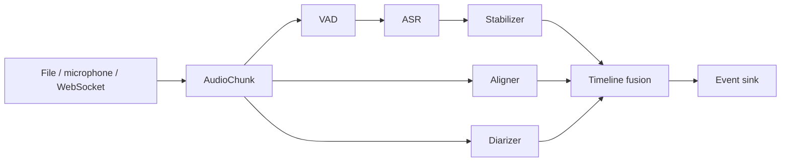

# Architecture

## Stable core

The core owns only data contracts and orchestration:



ASR text, word timing and speaker turns are independent tracks. A backend may
provide more than one track, but the pipeline must not assume that it does.

## Plugin contract

Plugins register Python entry points without modifying the core project:

```toml
[project.entry-points."turnalign.backends"]
my_model = "my_package:MyAsrBackend"

[project.entry-points."turnalign.vad"]
my_vad = "my_package:MyVadBackend"

[project.entry-points."turnalign.alignment"]
my_aligner = "my_package:MyAlignmentBackend"

[project.entry-points."turnalign.diarization"]
my_diarizer = "my_package:MyDiarizationBackend"
```

VAD plugins emit original-timeline `SpeechSegment` objects rather than bare PCM
chunks. Each segment carries its start/end, confidence when available, whether
it was cut by the model-duration limit, and backend metadata. The file CLI
persists both speech and inferred skipped intervals to an audit JSONL and adds
coverage totals to the terminal event.

Heavy dependencies belong to the plugin package. Importing `turnalign` must not
initialize PyTorch, download weights, probe a GPU or contact a network service.

An ASR entry point receives one `AsrConfig` object. It may expose a class
constructor or a `create(config)` factory and must implement `AsrBackend`.
Optional dependencies are imported inside the constructor, so `turnalign
backends` can enumerate adapters without loading model runtimes.

The built-in adapters demonstrate four integration styles:

- `glm-asr`: Transformers generation model with text-only timing.
- `transformers-whisper`: Transformers ASR pipeline with word timestamps.
- `faster-whisper`: CTranslate2 inference with word timestamps.
- `funasr`: FunASR `AutoModel` adapter for Paraformer, SenseVoice and compatible models.
- `whisper-cpp`: local command-line executable and JSON result parsing.

The first-party optional FunASR component set demonstrates the remaining
contracts:

- `fsmn-vad`: offline speech regions, split to the requested maximum ASR window.
- `paraformer`: monotonic mapping from Paraformer timestamps to the final ASR text.
- `campp`: offline speaker turns from FunASR's Paraformer/FSMN/CAM++ pipeline.

They are imported lazily and require the `funasr-pipeline` extra. A session may
use different devices per component, such as MPS for GLM-ASR and CPU for all
three FunASR components.

## ASR hints and private context

`AsrHints` is the backend-neutral contract for optional phrases, free-form topic
context, and a future numeric boost. Backends declare `hotwords`,
`context_prompt`, and `hotword_boost` capabilities before model construction, so
unsupported combinations fail without loading model weights.

- GLM-ASR compiles phrases and context into a bounded transcription prompt.
- Transformers Whisper and whisper.cpp receive initial prompt text.
- faster-whisper receives native `hotwords` plus `initial_prompt`.
- FunASR receives its native `hotword` generation option.

Event metadata contains only the hint method, phrase count, context-present flag,
and boost-present flag. It must never contain the actual private values. Plugin
authors should preserve this redaction rule even when an upstream runtime uses a
different request schema.

## Event semantics

- `partial`: visible low-latency hypothesis; replaceable.
- `commit`: stable text appended to the transcript.
- `replace`: revise an existing segment by stable `segment_id`.
- `speaker_merge`: merge online speaker clusters without rewriting all text.
- `end`: input ended and all components flushed.

Every event has a monotonic `revision`. Consumers ignore older revisions. The
server stores model-native metadata, but clients can operate on common fields.

## Input and transport

`file_chunks` decodes WAV directly and uses a local FFmpeg subprocess for other
formats. `microphone_chunks` uses an optional PortAudio binding. Both emit PCM16
`AudioChunk` objects. The WebSocket server accepts the same PCM bytes, so local
CLI and network sessions share endpointing and event generation code.

Batch ASR models are usable in live sessions through rolling inference and
utterance endpointing: growing windows produce revisable partials, while
configurable silence or a maximum duration commits the utterance. A native
streaming plugin consumes the continuous iterator and emits its own updates.
The default server binds to loopback. See `docs/websocket.md` for the wire format.

## Hardware policy

Hardware selection is a plugin concern. Each backend declares supported
accelerators and accepts an explicit user override. Recommended implementations:

| Platform | Preferred runtime | Fallback |
|---|---|---|
| NVIDIA Windows/Linux | CUDA PyTorch or TensorRT | CPU/ONNX |
| AMD Windows | ROCm PyTorch where supported | CPU/ONNX; DirectML requires an external experimental adapter and the structured-generation workaround documented in [validation.md](validation.md) |
| AMD Linux | ROCm PyTorch | CPU/ONNX |
| Apple Silicon | Metal/MPS or CoreML | CPU/ONNX |
| Intel/portable CPU | ONNX Runtime/OpenVINO | native CPU |

Automatic detection must be observable: every session reports selected backend,
runtime, device, precision, model revision and fallback reason.

## Proposed first production pipeline

- VAD: FSMN-VAD or Silero.
- Text: GLM-ASR-Nano-2512.
- Stable commit: LocalAgreement with a 2–4 second revisable tail.
- Timing: Paraformer timestamp track mapped to final text.
- Speakers: CAM++ online clusters, optionally refined by pyannote offline.
- Transport: WebSocket JSON events; recorded WAV is the recovery source of truth.

The online output is intentionally provisional. At utterance end and meeting end,
the same segment IDs are revised with longer context, better alignment and global
speaker clustering.

## Offline scheduling

For file transcription, CPU diarization may run concurrently with GPU/MPS ASR
after the audio has been decoded once. CPU-only combinations remain sequential
by default to avoid oversubscription. Paraformer alignment supports bounded
batching after both tracks complete; the default batch of four was selected from
full-recording benchmarks because larger batches were not monotonically faster.
The final event reports per-stage wall time and the scheduling mode so performance
changes remain observable without changing transcript event semantics.

Device-aware execution profiles sit above backend configuration. They provide
platform defaults only: explicit ASR or component devices, batch sizes, and
parallel flags retain precedence. Auto selection distinguishes Apple MPS,
single- and multi-GPU NVIDIA CUDA, AMD ROCm on Linux versus Windows, and CPU-only
hosts. ROCm is exposed as `rocm:N` at the CLI boundary and normalized to PyTorch's
intentional `cuda:N` HIP device syntax inside components.
