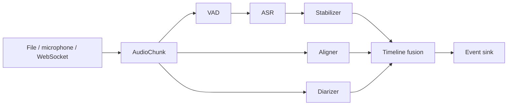

# Architecture

## Stable core

The core owns only data contracts and orchestration:



ASR text, word timing and speaker turns are independent tracks. A backend may
provide more than one track, but the pipeline must not assume that it does.

## Plugin contract

Plugins register Python entry points without modifying the core project:

```toml
[project.entry-points."turnalign.backends"]
my_model = "my_package:MyAsrBackend"

[project.entry-points."turnalign.vad"]
my_vad = "my_package:MyVadBackend"

[project.entry-points."turnalign.alignment"]
my_aligner = "my_package:MyAlignmentBackend"

[project.entry-points."turnalign.diarization"]
my_diarizer = "my_package:MyDiarizationBackend"
```

Heavy dependencies belong to the plugin package. Importing `turnalign` must not
initialize PyTorch, download weights, probe a GPU or contact a network service.

An ASR entry point receives one `AsrConfig` object. It may expose a class
constructor or a `create(config)` factory and must implement `AsrBackend`.
Optional dependencies are imported inside the constructor, so `turnalign
backends` can enumerate adapters without loading model runtimes.

The built-in adapters demonstrate four integration styles:

- `glm-asr`: Transformers generation model with text-only timing.
- `transformers-whisper`: Transformers ASR pipeline with word timestamps.
- `faster-whisper`: CTranslate2 inference with word timestamps.
- `funasr`: FunASR `AutoModel` adapter for Paraformer, SenseVoice and compatible models.
- `whisper-cpp`: local command-line executable and JSON result parsing.

## Event semantics

- `partial`: visible low-latency hypothesis; replaceable.
- `commit`: stable text appended to the transcript.
- `replace`: revise an existing segment by stable `segment_id`.
- `speaker_merge`: merge online speaker clusters without rewriting all text.
- `end`: input ended and all components flushed.

Every event has a monotonic `revision`. Consumers ignore older revisions. The
server stores model-native metadata, but clients can operate on common fields.

## Input and transport

`file_chunks` decodes WAV directly and uses a local FFmpeg subprocess for other
formats. `microphone_chunks` uses an optional PortAudio binding. Both emit PCM16
`AudioChunk` objects. The WebSocket server accepts the same PCM bytes, so local
CLI and network sessions share endpointing and event generation code.

Batch ASR models are usable in live sessions through rolling inference and
utterance endpointing: growing windows produce revisable partials, while
configurable silence or a maximum duration commits the utterance. A native
streaming plugin consumes the continuous iterator and emits its own updates.
The default server binds to loopback. See `docs/websocket.md` for the wire format.

## Hardware policy

Hardware selection is a plugin concern. Each backend declares supported
accelerators and accepts an explicit user override. Recommended implementations:

| Platform | Preferred runtime | Fallback |
|---|---|---|
| NVIDIA Windows/Linux | CUDA PyTorch or TensorRT | CPU/ONNX |
| AMD Windows | ROCm PyTorch where supported | CPU/ONNX or DirectML plugin |
| AMD Linux | ROCm PyTorch | CPU/ONNX |
| Apple Silicon | Metal/MPS or CoreML | CPU/ONNX |
| Intel/portable CPU | ONNX Runtime/OpenVINO | native CPU |

Automatic detection must be observable: every session reports selected backend,
runtime, device, precision, model revision and fallback reason.

## Proposed first production pipeline

- VAD: FSMN-VAD or Silero.
- Text: GLM-ASR-Nano-2512.
- Stable commit: LocalAgreement with a 2–4 second revisable tail.
- Timing: Paraformer timestamp track mapped to final text.
- Speakers: CAM++ online clusters, optionally refined by pyannote offline.
- Transport: WebSocket JSON events; recorded WAV is the recovery source of truth.

The online output is intentionally provisional. At utterance end and meeting end,
the same segment IDs are revised with longer context, better alignment and global
speaker clustering.
